# XR Guild Hall · Guild Hall + Library (v3)

An immersive WebXR home for the XR Guild. It has two chambers joined by an open labradorite colonnade, set in a garden under an aurora sky. It runs in any modern browser (desktop, phone, Quest, Pico, and other WebXR headsets) with no install, and it is ready to publish to VIVERSE.

Built with Meta's open-source **Immersive Web SDK** (`@iwsdk/core`, MIT) on three.js. September 2026.

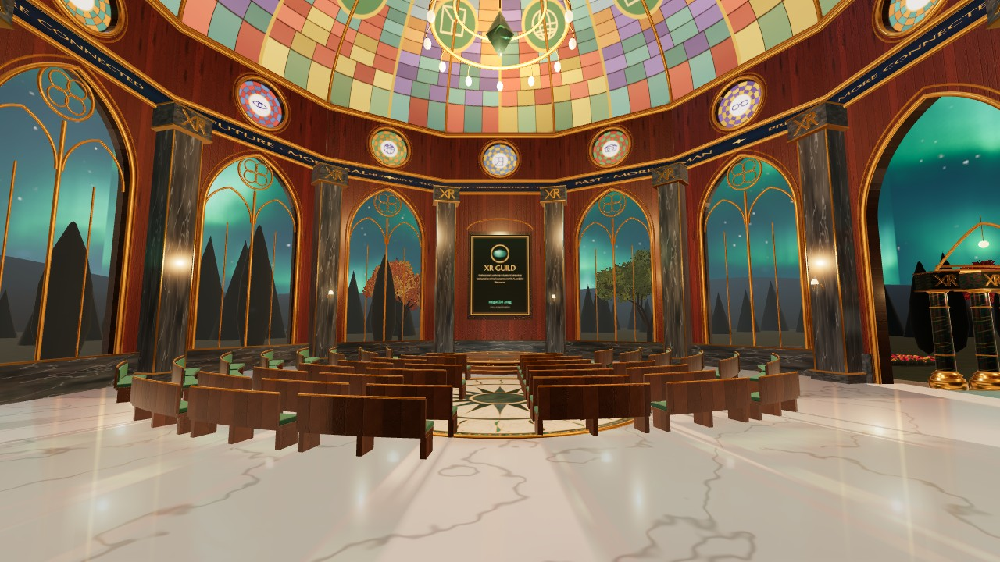

## What changed in v3 (Sept 28, 2026)

- **Guild Hall at DeeDee Chainey Jones's scale** ("Guild Draft 3" on arrival.space), about 29 m across, built from her design elements:
  - square dark-marble pillars, a marble wainscot, and dark cherry plank walls;
  - tall gilt gothic windows with mullions and a four-foil oculus;
  - a clerestory band of stained-glass roses (placeholder art, ready to swap for commissioned glass);
  - a stained-glass dome with XR roundels and XR GUILD around the oculus;
  - a grey-veined marble floor.
- **XR monogram capitals:** every column (Hall, colonnade, Library) is topped with a shiny gilt monogram in which the X and the R share one stroke.
- **Wood grain:** every wood surface now uses strong procedural grain with bump relief.
- **Curved green-velvet benches** for 3 or 4 people, following the curve of the stage, laid out as a proscenium (the default, up to 200 seats). Cabaret tables and an open floor are the other options.
- **Longer colonnade:** 17 m between the doors, with more columns, so the two rooms' voices stay apart.
- **Bigger reflecting pool** (18 × 9 m) with Alhambra-style zellige: eight-point stars, with a tiny gold cube for XR at each centre.
- **Portal sites reserved** behind the Hall, north of the colonnade, and behind the Library. Each has a gravel pad and a dormant labradorite ring.

| | |
|---|---|
| 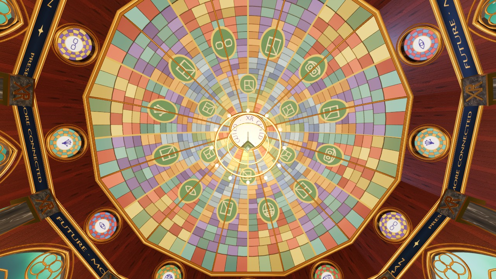 | 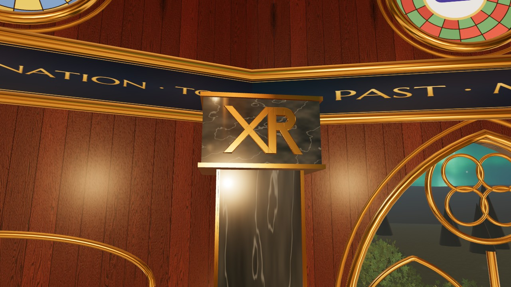 |
| 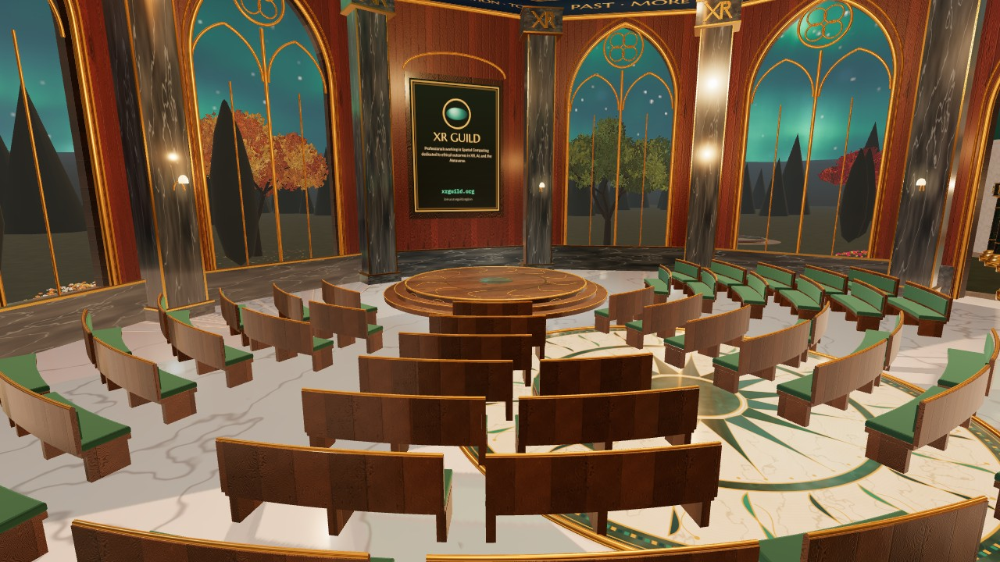 | 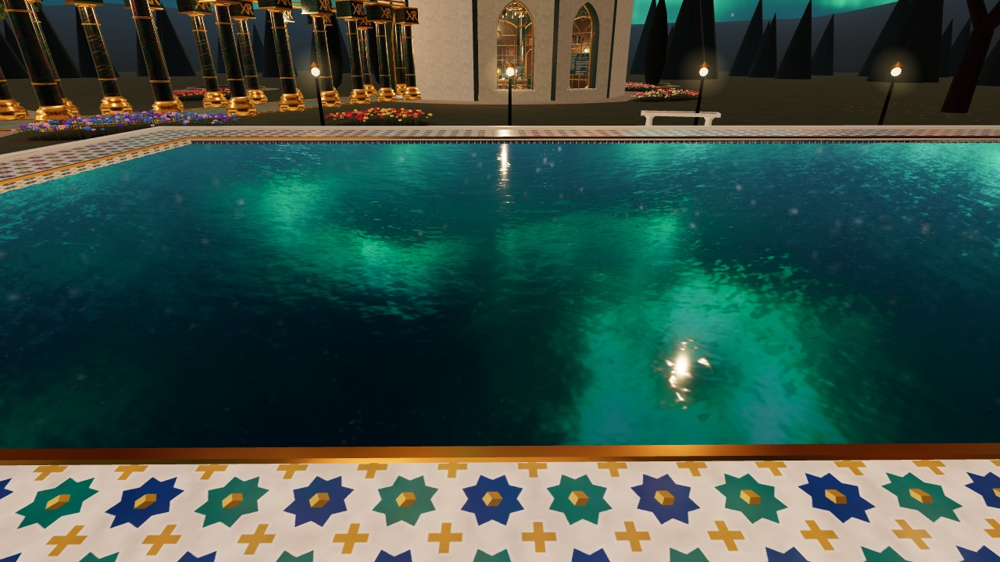 |
| 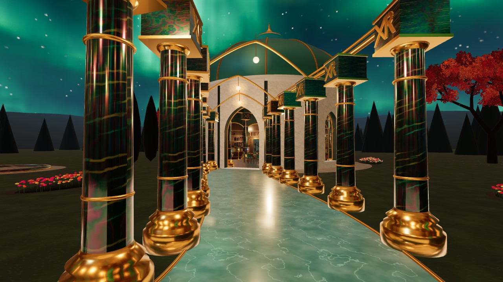 | 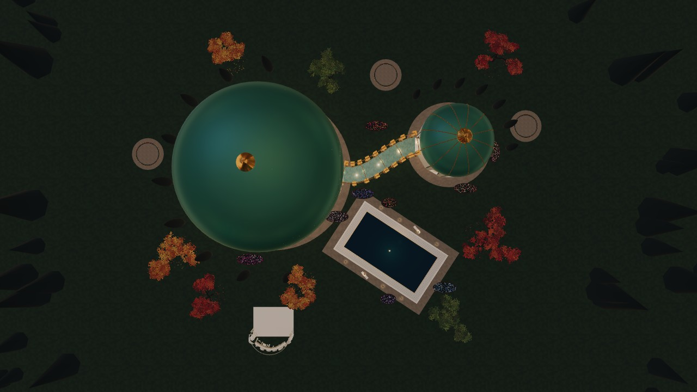 |

## The site

Evo's sketch, as built:

- **Guild Hall:** the west 12-gon.
- **Library:** the north-east 12-gon.
- **Colonnade:** an S-curved teal path lined with labradorite columns, open to the garden on both sides.
- **Reflecting pool:** a diagonal pool in the garden to the south.

| Space | What you can do |
|---|---|
| **Guild Hall** | Arrive by the **welcome desk** inside the east door. Its main action is **Join the Guild**: buttons for xrguild.org, Join, Events, Mentorship and Principles, plus a QR code for xrguild.org/join. Next to it, the **notice board** shows upcoming Guild events (a snapshot of xrguild.org/calendar) and a Meta Connect 2026 poster. To the north, a round **walnut stage with gilt detailing** holds up to 5 people, and it has gentle steps on every side. Behind it, a banner carries the Guild's mission line and **xrguild.org**. The walls are pointed Gothic arches with **clear glass and gilt Art Nouveau tree tracery**, set between labradorite columns. |
| **Seating** | Choose **theater rows** or **in the round** (110 seats each), or **cabaret tables** (108 seats). Click or select a chair to sit, and walk away to stand. |
| **Library** | The **Library guide lives here only.** Three bookcases hold the panels built into their shelves: **Connect news**, **Library search** (225 works from library.xrguild.org), and the **Timeline of XR** (209 entries). The shelves are only partly filled with books, which leaves room for real ones. At the centre is the **Connect table**: device lineage, pick-up period devices, and the illustrative Meta VR Glasses hologram. Nine category lanterns stand around it. Seating: **round table**, **reading circle**, or **seminar**, 15 seats each. |
| **Colonnade and garden** | The walk between the chambers. The garden has branched **maples** in crimson, amber and green, beds of flowers in many colours, the reflecting pool with benches at each end, and Evo's white colonnade model as a garden folly. |
| **People** | Presence, chat, VRM avatars, and spatial voice are built in. See [`MULTIPLAYER.md`](MULTIPLAYER.md). With no server configured, **Preview a crowd** simulates 60 visitors offline. |

| | |
|---|---|
| 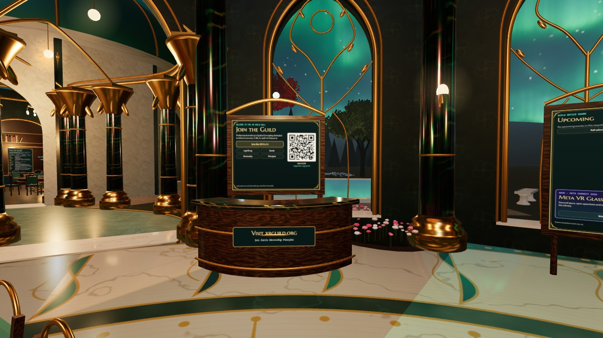 | 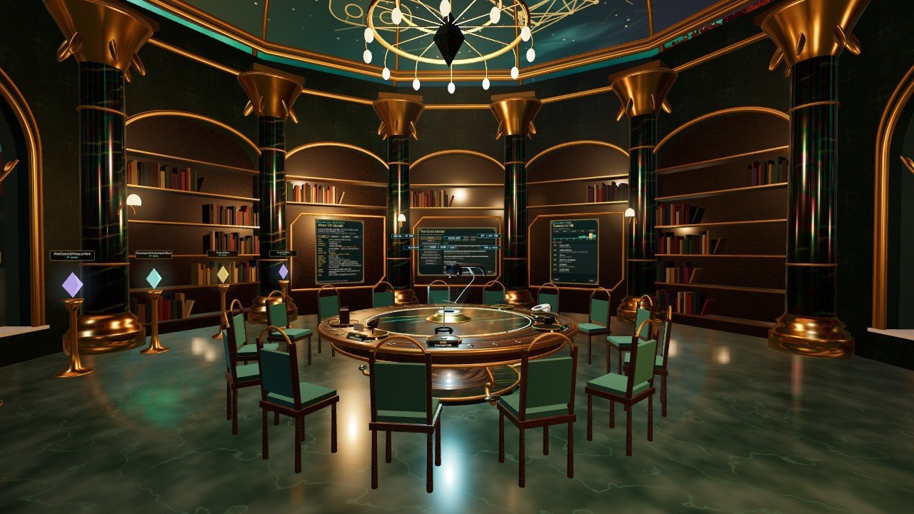 |
| Welcome desk with the Join panel and QR code, and the notice board | Library: panels built into the bookcases, round-table seating around the Connect table |
| 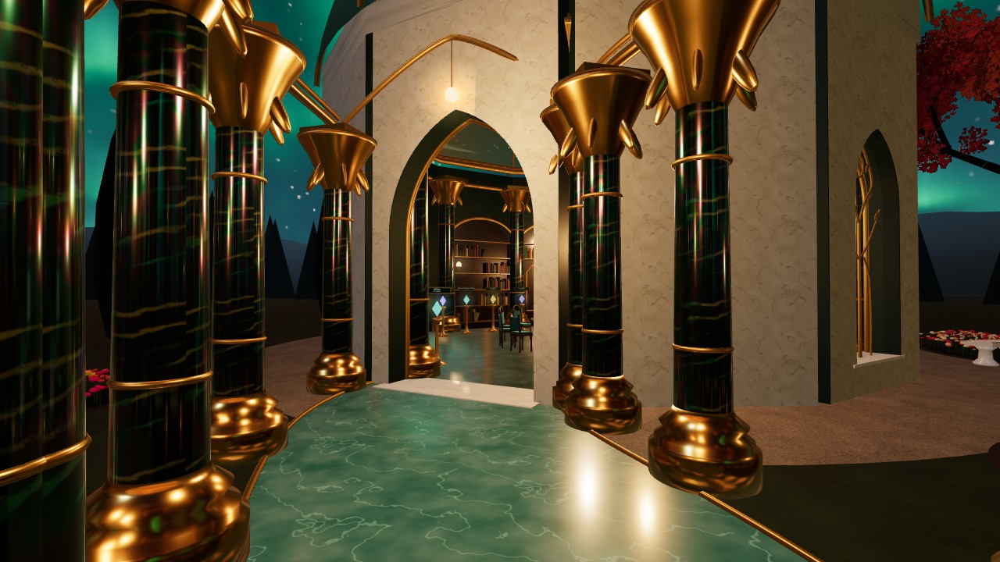 | 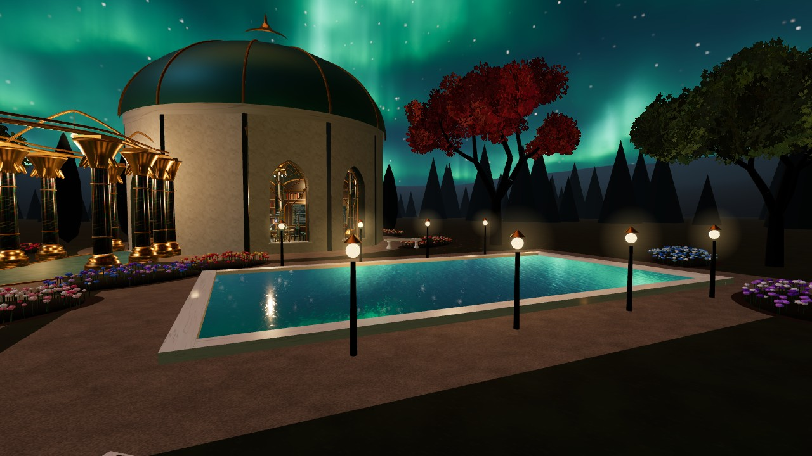 |
| The labradorite colonnade to the Library | Reflecting pool, maples, and flower beds |
| 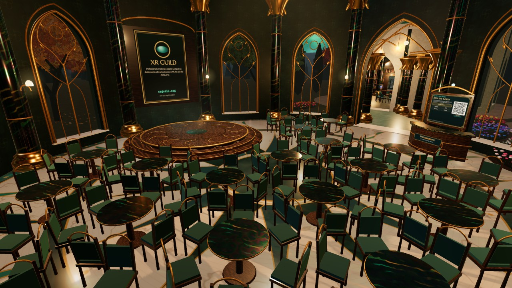 | 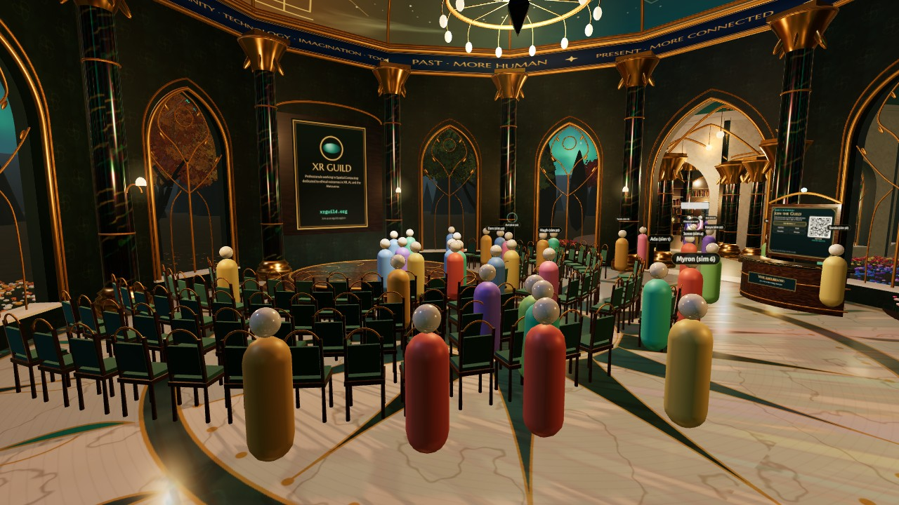 |
| Cabaret preset | 60 simulated visitors (mannequins stand in for people without a VRM) |
| 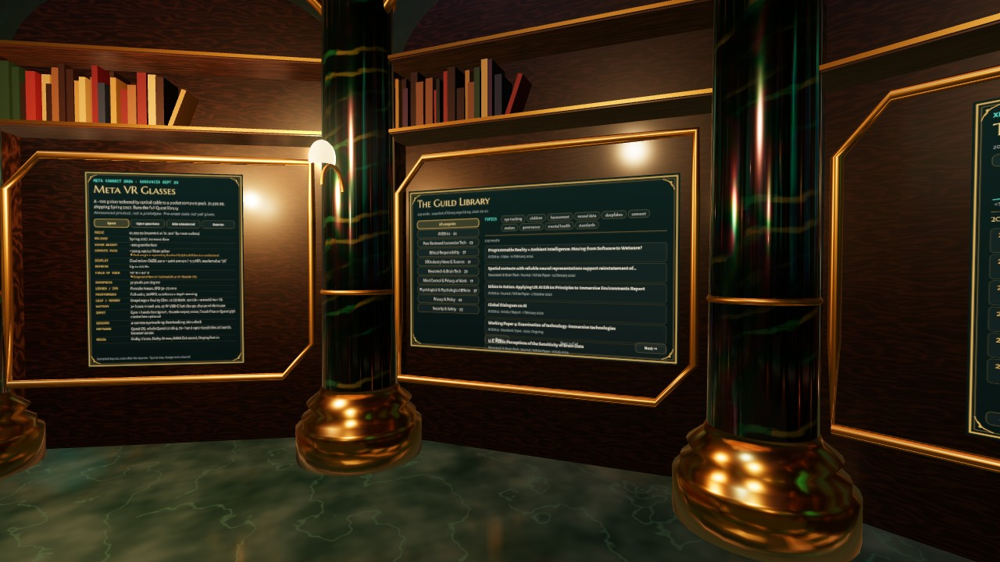 | 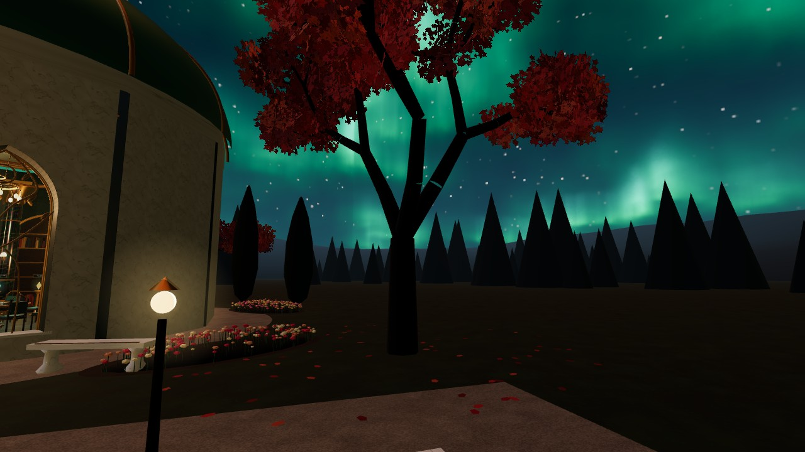 |
| News, Library search and Timeline shelves | A branched maple outside the Library |

The pilot (v1) screenshots are kept in `docs/images/pilot-v1/`.

## Run it

```bash
cd guild-hall-library
npm install
npm run dev          # http://localhost:5173
npm run build        # → dist/  (static site, relative paths)
npm run preview      # serve dist/ locally
# try the crowd: http://localhost:4173/?sim=100
```

Needs Node 20.19+.

### Configuration (all optional)

| Variable | What it turns on |
|---|---|
| `VITE_VIVERSE_APP_ID` | VIVERSE login, the visitor's own VRM avatar, and shared rooms through the VIVERSE Play SDK |
| `VITE_LIVEKIT_TOKEN_URL` | Spatial voice through LiveKit Cloud. Deploy [`proxy/livekit-token-worker.js`](proxy/livekit-token-worker.js) first. Off VIVERSE, this also carries presence and chat. |
| `VITE_ASK_PROXY` | Inline answers from the library's GitBook assistant ([`proxy/ask-worker.js`](proxy/ask-worker.js)) |

URL flags: `?sim=N` runs a simulated crowd of N (up to 300) that never leaves the browser.

## Controls and comfort

- **Desktop:** drag to look, WASD or arrows to walk, Q/E to turn, double-click the floor to move there, click objects, panels, and chairs.
- **Phone:** drag to look, double-tap the floor to move, tap objects. The **Walk to** buttons jump between places.
- **VR:** thumbstick teleport and **45° snap turn** by default. Point and trigger (or pinch) at panels and chairs. Squeeze or pinch to pick up devices.
- **Comfort rating: Comfortable.** No forced camera motion, and walk-to jumps fade instead of gliding. The Comfort menu can reduce motion, stop the aurora, and turn off mirror reflections.

## XR Guild principles checklist

- [x] Teleport and snap turn by default
- [x] No strobing; ambient animation can be stopped
- [x] Every panel and chair works with a single trigger, pinch, click, or tap
- [x] **Consent before connecting:** a code of conduct, a chosen display name, and the **mic off by default**
- [x] **Mute and Block** for every person, plus a personal-space bubble (0.6 m)
- [x] Only name, avatar, position, zone, and seat are shared. **No gaze, hand, or device data.** Solo mode has no accounts, analytics, or tracking.
- [x] Links from the world open only when you press them; in VR the panels show a QR code instead
- [x] News is sourced line by line; the glasses model is labeled *illustrative*
- [ ] Seated-reach audit **in headset** by a second volunteer
- [ ] Moderator and reporting route for public events (see `MULTIPLAYER.md`)

## How it's built

```
guild-hall-library/
├── index.html              2D shell: loading, zone-aware guide, social dock, code of conduct
├── src/
│   ├── main.ts             boots IWSDK, builds the site, per-frame system, zones, sitting
│   ├── site.ts             site plan: chamber centres, door, stage, desk, pool, colonnade path, zones
│   ├── chamber.ts          12-sided chamber builder: pointed arches, Nouveau window tracery, labradorite columns,
│   │                       bookcases with built-in panel openings and sparse books, dome, frieze, chandelier
│   ├── walk.ts             the labradorite colonnade and teal path
│   ├── hallfeatures.ts     stage, welcome desk + Join panel + QR, notice board, mission banner
│   ├── seating.ts          instanced chairs and tables, six presets
│   ├── table.ts            the Connect table, device lineage, VR Glasses hologram
│   ├── library3d.ts        Library category lanterns
│   ├── garden.ts           pool, maples (leaf cards), flower beds, benches, folly
│   ├── avatars.ts          crowd renderer: instanced mannequins + nearest-N VRM (three-vrm), tags, bubbles
│   ├── net/                presence core, VIVERSE Play SDK, LiveKit voice/data, simulated crowd
│   ├── social.ts           social dock, chat, people list, seating toggles, events list
│   ├── panel.ts / xrpanels.ts / interact.ts / ui.ts   panels and the 2D guide
│   ├── sky.ts / tex.ts / mats.ts / bake.ts            aurora, procedural materials, static batching
│   └── data/               library.json, timeline.json, events.json, news.ts
├── public/models/hall.glb  Evo's white colonnade (garden folly)
├── models-source/          Evo's fantasy-library GLB (kept, not shipped: see below)
├── proxy/                  ask-worker.js, livekit-token-worker.js
└── scripts/refresh-data.py re-pull the library, timeline and events snapshots
```

**Performance:**
- With 100 simulated people in view in the hall, a frame measured about 140 draw calls and 0.5 M triangles.
- The main code is about 1.7 MB (0.5 MB gzipped). Voice (0.55 MB) and VRM (0.14 MB) load only when someone connects.
- **The fantasy-library GLB (8.4 MB) is no longer loaded.** The Library is now a real chamber, and dropping the model cut the download by about 80%, which matters for 100+ people arriving at once. The file is kept in `models-source/` if the team wants it back, for example as a separate reading-room scene.

**Data:** run `python3 scripts/refresh-data.py` to refresh the library, timeline, and events snapshots, then rebuild.

## Credits

- Design direction, concept art, sketches, and 3D models: **Evo** (Realitycraft), artist and technologist, for the XR Guild
- Library data: [XR Guild Library](https://library.xrguild.org) volunteers
- Timeline data: the XR Guild community [Timeline of XR](https://www.xrguild.org/timeline)
- Built with the [Immersive Web SDK](https://github.com/facebook/immersive-web-sdk) (MIT), [three.js](https://threejs.org) (MIT), [three-vrm](https://github.com/pixiv/three-vrm) (MIT), [LiveKit client](https://github.com/livekit/client-sdk-js) (Apache-2.0), and the VIVERSE JS SDK
